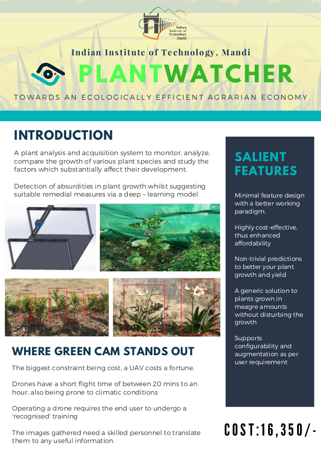

# PlantWatcher-SSD
This is an implementation of [Single Shot MultiBox Detector](https://arxiv.org/abs/1512.02325) in PyTorch trained on plant images, done as a part of an academic project, Design Practicum. Below poster represents a gist of the motive behind project.

## Use pretrained VGG16 model
I do not recommend training SSD from scratch. Using pretrained VGG model helps a lot to achieve lower losses.
I use the pretrained [pytorch/vision](https://github.com/pytorch/vision#models) VGG16 model from [PyTorch model zoo](https://download.pytorch.org/models/vgg16-397923af.pth).

## Credit
This implementation is initially inspired by:
- [Hakuyume/chainer-ssd](https://github.com/Hakuyume/chainer-ssd)  
- [amdegroot/ssd.pytorch](https://github.com/amdegroot/ssd.pytorch)  
